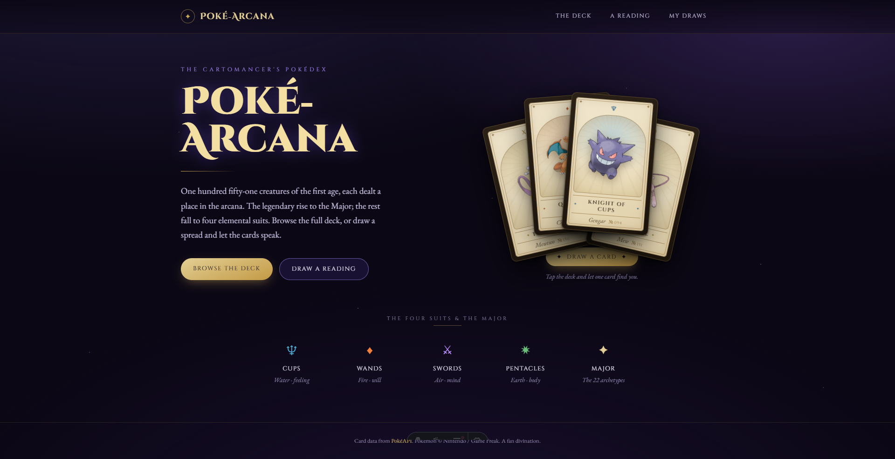

# Poké-Arcana

A tarot deck reimagined with Pokémon. Every Pokémon is a tarot card, deterministically mapped to the traditional 78-card structure. Browse the deck, discover your card, or draw a reading.



## Features

- **Smart Card Mapping** — Legendary Pokémon become Major Arcana; everyone else maps to Minor Arcana suits based on their type and stats
- **Full Deck Browser** — Interactive grid view with filtering by suit and Major Arcana
- **Card Detail Pages** — Individual pages for each card with Pokémon data and real Rider-Waite-Smith tarot art
- **Fortune Reading** — Draw spreads (1, 3, or 10 cards) with shuffle and flip-reveal animation
- **AI Interpretation** — Generate personalized AI readings (optional; requires API key for Gemini, Groq, or OpenRouter)
- **My Draws History** — Auto-save and revisit past readings stored in browser localStorage (20 most recent)
- **Deterministic & Scalable** — Assignment algorithm is automatic and data-driven, so expanding to new generations is just a config change
- **Optimized Assets** — Card art in WebP format for smaller bundle size; no runtime overhead

## Tech Stack

- **Astro 7** — Static site generation with server adapter for API routes
- **Bun** — Package manager & script runner
- **TypeScript** — Type-safe development
- **Tailwind CSS v4** — Utility-first styling
- **Vercel** — Edge deployment for API routes; static prerendering for pages

## Quick Start

```bash
bun install
bun run dev        # dev server at http://localhost:4321
bun run build      # static build to dist/
bun run preview    # serve the built output
bun run sync       # sync Pokémon data from PokéAPI
```

AI-generated readings on `/reading` require at least one of `GEMINI_API_KEY`, `GROQ_API_KEY`, or `OPENROUTER_API_KEY` to be set (locally in `.env`, or as a Vercel project env var) — see `.env.example`. Without any key set, the page still works and falls back to a template-based reading. The provider chain uses exponential backoff and automatic failover, so a single provider is sufficient.

## How It Works

### Pokémon → Tarot Mapping

The assignment algorithm is **fully deterministic**, derived from each Pokémon's own data:

- **Legendary / Mythical** → One of 22 Major Arcana archetypes (stable hash of Pokédex ID)
- **Standard Pokémon** → Minor Arcana suit (Cups / Wands / Swords / Pentacles) determined by type + weighted vote
  - Rank (Ace–King) is the Pokémon's base-stat-total percentile within its suit

See `src/lib/arcana/` for implementation details.

### Data Pipeline

Pokémon data is fetched **once at build time**, never at runtime:

1. `bun run sync` fetches data from [PokéAPI](https://pokeapi.co) for a configured range
2. Results are written to `src/data/generated/` and committed to git
3. `astro build` reads the committed data (no network calls)

Configure the Pokédex range in `.env` (v1 = Gen 1, #1–151). Expanding to new generations is a matter of updating `DEX_START` / `DEX_END` and rerunning `sync`.

## Routes

- `/` — Landing page
- `/deck` — Browsable deck with filtering
- `/deck/[slug]` — Individual card details (Pokémon card with arcana cross-reference)
- `/card/[slug]` — Arcana detail page with Rider-Waite-Smith art and tarot metadata
- `/reading` — Draw and interpret spreads
- `/history` — Revisit past draws stored in browser
- `POST /api/reading` — AI reading generation endpoint (Vercel Edge)

## Project Structure

- **`src/lib/arcana/`** — Core tarot mapping logic
- **`src/components/`** — Astro components and Web Components
- **`src/data/`** — Pokémon data and content
- **`scripts/`** — Data sync and utility scripts
- **`openspec/`** — [OpenSpec](https://github.com/Fission-AI/OpenSpec) project spec

For conventions and workflow details, see [`AGENTS.md`](./AGENTS.md) and [`spec.md`](./spec.md).
